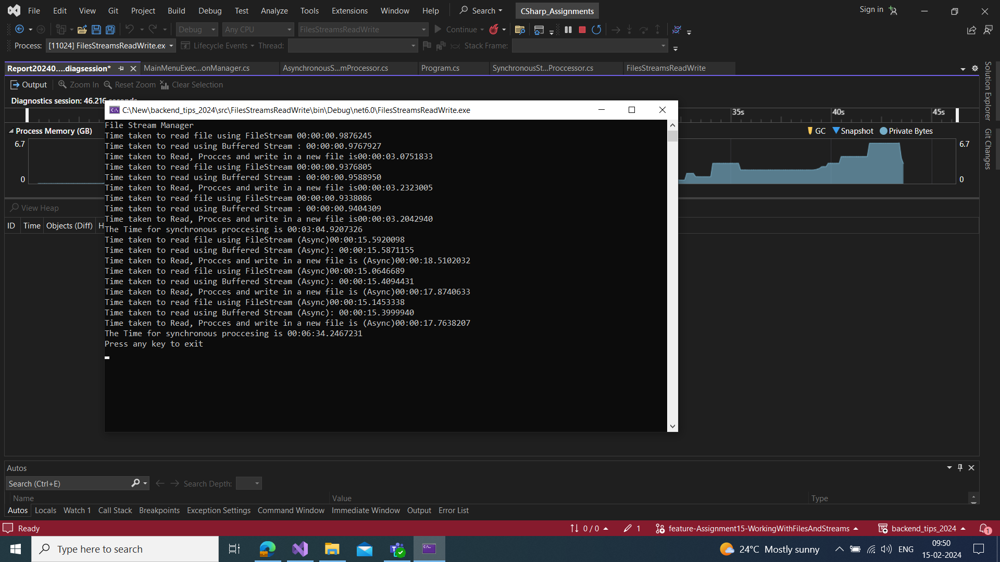
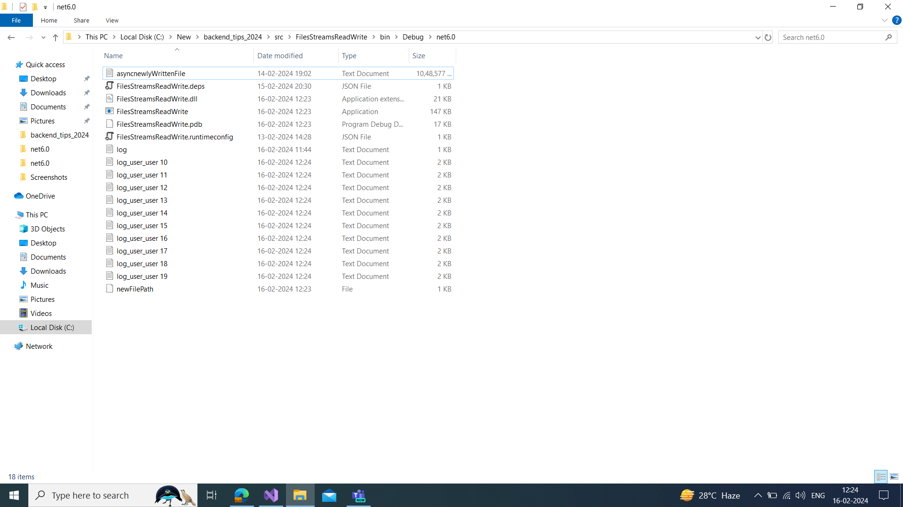

# Working with Files and Streams

## Task 1

- Executed Stream Reader for multiple files.
- The file paths are passed to the respective funtionc as dictionary pairs
- The File Stream reader creates the 1 GB text file.
- used Both File streamand buffered stream to read text files the tiem were compared

## Task 2

- All the Functioalities in the task 1 were made to Async Functions 
- The await keyword is used to call the async functions

## Task 3 

- The Fiven Code is modified with Stream reader.
- Nested Using statements,
- `memoryStream.WriteTo(fileStream)` were used to write the file from memeory stream to files

## Task 4 

- The Given code will throw error in the function call
- The Modified Logger uses the Lock keyword which will lock the thread. 

