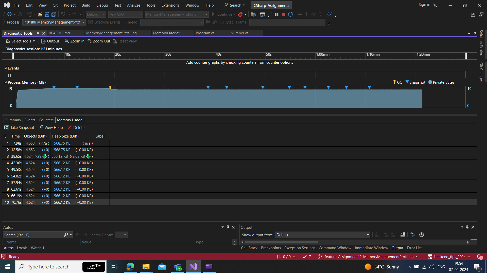

# Memory Management Profiling

### Task 1

#### Observation of Memory leak with VS Diagnostic Tool

        public void Allocate()
        {
            while (true)
            {
                this._memAlloc.Add(new int[1000]);
                Thread.Sleep(10);
            }
        } 
  
- This Code Snippet creates inifinite integer array with lenght of 1000. 
- As we know, The Garbage Collector will assume that it as short Living object
- keeps it in the Generation 0 GC which will exponentially allocates memory, 
- Which creates a memory leak beacuse this short object is not short lived. 

 

Hence the memory is allocating and leaking exponentially. 

### Task2

#### Observing the memory using clearig the List

        public void Allocate()
        {
            while (true)
            {
                try
                {
                    this._memAlloc.Add(new int[1000]);
                    Thread.Sleep(10);
                }
                finally
                {
                    this._memAlloc.Clear();
                }
            }
        }

- Here a try and finaly block is used, in finally block the list is cleared so the short lived objects are deleted.
- As the lists are cleared immediately in the finally block, 
- So the objects are short lived.

 

